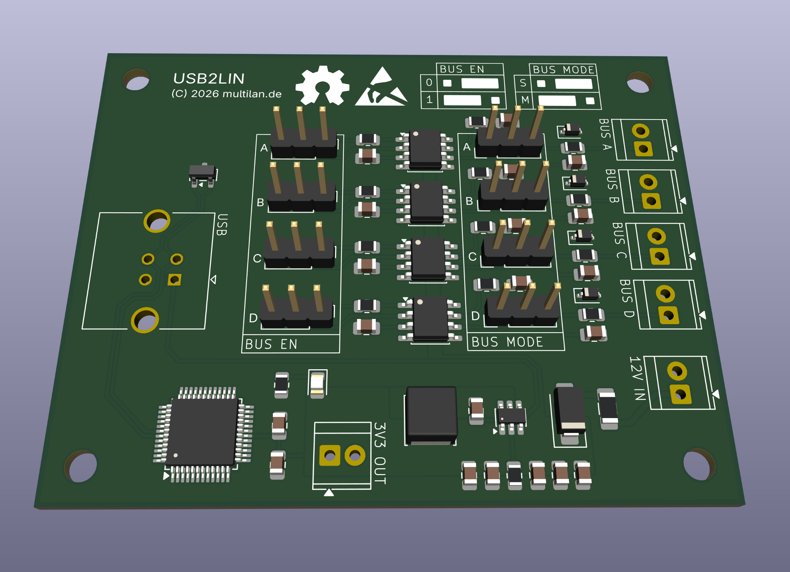
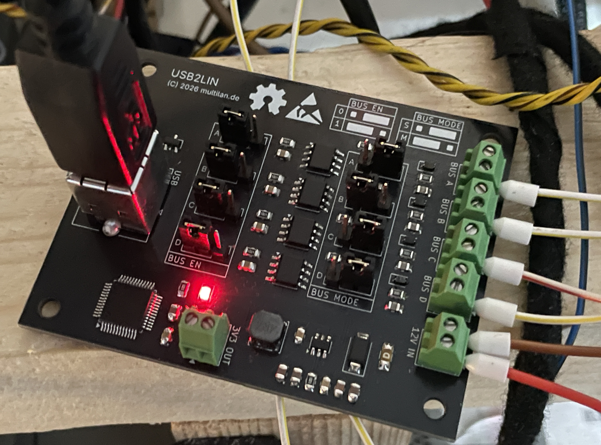

## USB2LIN

This is a 4-channel interface for LIN buses.\
It is using 4 NXP TJA1021 and a MaxLinear XR21V1414IM USB to UART bridge. 

Tested with BMW I/K-Bus, but it should work with any LIN bus.

---

### Gerber Files 
The gerber file is ready for ordering at JLCPCB.


### Parts
The schematic contains LCSC part numbers which can be exported to a BOM.

### Udev rules
This repository contains an udev rules file that maps the UART ports to ```/dev/usb2lin/a@,b@,c@,d@```, matching the boards silkscreen.

---



